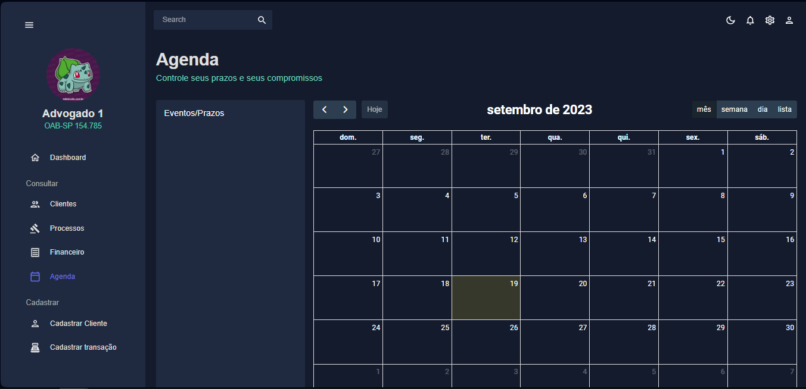

<!-- PROJECT TITLE -->
<h1 align='center'id="top"> ⚖️ == Sistema Jurídico == ⚖️ </h1>

<!-- PROJECT MENU -->
<p align="center">

<a href="#sobre">Sobre</a> &#xa0; | &#xa0;
<a href="#tecnologias">Tecnologias</a> &#xa0; | &#xa0;
<a href="#funciona">Funcionalidades</a> &#xa0; | &#xa0;  
 <a href="#pendente">Pendências</a> &#xa0; | &#xa0;
<a href="#imagens">Imagens</a> &#xa0; | &#xa0;  
<a href="#requisitos">Pré requisitos</a> &#xa0; | &#xa0;  
 <a href="#desenvolvedores">Desenvolvedores</a> &#xa0;

</p>

<!-- STATUS -->

<!-- PROJECT SOBRE -->
<h2 id="sobre">📓 Sobre </h2>
<p align="justify">Projeto pessoal desenvolvido em React e Express. O projeto visa a organização de um escritório jurídico, contando com página de consulta e cadastro de clientes, processos e movimentações financeiras. A exibição do aplicativo depende do tipo de cargo que você tem no escritório.</p>

<!-- PROJECT SITE -->
<!-- <h2 id="site">:earth_americas: Link do site </h2>
<p>🔗 <a href="https://dizzy-future-eats.surge.sh/" target="_blank"> Future Eats </a>  </p> -->
<!-- <a href="https://dizzy-future-eats.surge.sh/" onclick="return ! window.open(this.href);"> Open in a new window</a> -->

<!-- PROJECT TECHNOLOGIES -->
<h2 id="tecnologias"> 🛠 Tecnologias </h2>

Abaixo segue o que foi utilizado na criação deste projeto:

<h3>FRONTEND</h3>

<p>🔗 <a href="https://vitejs.dev" target="_blank"> Vite </a> - Vite.js é um ambiente de desenvolvimento rápido e leve para a criação de aplicativos web modernos em JavaScript e TypeScript. Ele foi criado com foco na velocidade e eficiência, tornando-o uma escolha popular para o desenvolvimento de projetos front-end. </p>
<p>🔗 <a href="https://pt-br.reactjs.org/" target="_blank"> ReactJS </a> - O ReactJS é uma biblioteca JavaScript declarativa, eficiente e flexível para criar interfaces com o usuário. Ele permite compor UIs complexas a partir de pequenos e isolados códigos chamados “componentes”. </p>
<p>🔗 <a href="https://mui.com/pt/" target="_blank"> Material-UI </a> - O Material-UI fornece um componente opcional CssBaseline. Ele corrige algumas inconsistências nos navegadores e dispositivos, ao mesmo tempo em que fornece redefinições ligeiramente mais opinativas para elementos HTML comuns.</p>
<p>🔗 <a href="https://www.npmjs.com/package/axios" target="_blank"> React Axios </a> - Axios é um cliente HTTP baseado em Promises para fazer requisições. Pode ser utilizado tanto no navegador quanto no Node. js ou qualquer serviço de API.</p>
<p>🔗 <a href="https://reactrouter.com/web/guides/quick-start" target="_blank"> React-router-dom </a> - O React Router é uma lib completa para controle de rotas que permite que você consiga configurar as rotas utilizando o formato JSX e também disponibiliza uma API para você configurar diretamente via Javascript.</p>
<p>🔗 <a href="https://pt-br.reactjs.org/docs/hooks-intro.html" target="_blank"> React Hooks </a> - Eles permitem que você use o state e outros recursos do React sem escrever uma classe.
<p>🔗 <a href="https://www.npmjs.com/package/react-cookie" target="_blank"> React Cookie </a> - Permite que você gerencie os cookies do navegador ussando aplciação React.
<p>🔗 <a href="https://fullcalendar.io" target="_blank"> Full Calendar - Free </a> - Permite que você gere um calendário podendo acrescentar e deletar eventos.
<p>🔗 <a href="https://www.npmjs.com/package/react-pro-sidebar" target="_blank"> React Pro sideBar </a> - Fornece um conjunto de componentes para criar navegação lateral personalizável e de alto nível

<h3>BACKEND</h3>
<p>🔗 <a href="https://expressjs.com/pt-br/" target="_blank"> Express </a> - Com uma miríade de métodos utilitários HTTP e middleware a seu dispor, criar uma API robusta é rápido e fácil.
<p>🔗 <a href="https://www.mongodb.com/pt-br" target="_blank"> MongoDB </a> - O MongoDB é um banco de dados NoSQL, ou seja, não utiliza a estrutura de tabelas relacionais encontrada em bancos de dados SQL tradicionais. Em vez disso, ele armazena dados em um formato flexível de documento, geralmente no formato BSON (Binary JSON), que é uma extensão do JSON.
<p>🔗 <a href="https://mongoosejs.com" target="_blank"> Mongoose </a> - O Mongoose é uma biblioteca JavaScript que facilita a interação com bancos de dados MongoDB a partir de aplicativos Node.js.

<!-- PROJECT IT WORKS-->
<h2 id="funciona">🗹 Funcionalidades</h2>


- [x] Login;
- [x] SideBar;
- [x] Lista de clientes;
- [x] Cadastro de clientes;
- [x] Editar ctatus do cliente;
- [x] Lista de crocessos;
- [x] Cadastro de processos;
- [x] Editar status do processo
- [x] Controle de entradas de pagamentos;
- [x] Cadastro de entradas de pagamento;
- [x] Dar baixa no pagamento pendente;
- [x] Filtros em qualquer uma das funcionalidades;
- [x] Gerar relatórios em PDF de acordo com o filtro em qualquer uma das funcionalidades;
- [x] Agenda de compromisso;

### Integração com API

- [x] Login;
- [x] Cadastro de clientes;
- [x] Cadastro de processos;
- [x] Cadastro de dados de pagamentos;
- [x] Dados dos processos;
- [x] Dados dos clientes;
- [x] Dados de pagamentos;
- [x] Eventos na agenda;

<!-- PROJECT PENDING-->
<h2 id="pendente">⚠ Em desenvolvimento</h2>

- Funcionalidade para contagem de prazos e adicionar automaticamente na agenda;

- WebScrapping em sites de tribunais para filtrar publicações;

- Trocar imagem na SideBar dependendo do usuário;

- Sistema de Logout;

- Modal para exibir e modificar informações de cliente, processos e dados de pagamento;

- Modal para cadastro de cliente e pagamentos;

- Informações no Dashboard;

<!-- PROJECT IMG-->
<h2 id="imagens">💻 Layout</h2>

- Página de login

  

- SideBar Advogado

  

- SideBar Cliente
  

- Página de Cliente

  

- Cadastro de Cliente
  

- Página de Processo
  

- Cadastro de Processo

  

- Consulta Financeiro
  

- Cadastro Financiero
  

- Agenda
  

<!-- PROJECT REQUIREMENTS-->
<h2 id="requisitos">📝Pré-requisitos</h2>

Antes de começar, você vai precisar ter instalado em sua máquina as seguintes ferramentas:
[Git](https://git-scm.com), [Node.js](https://nodejs.org/en/), [MongoDB](https://www.mongodb.com/pt-br).
Além disto é bom ter um editor para trabalhar com o código como [VSCode](https://code.visualstudio.com/)

```
$ node -v
v12.19.0
$ npm -v
6.14.5
```

<h4>▶ Rodando o projeto </h4>
<h3> Frontend</h3>

```bash
# Clone este repositório
# HTTPS
$ git clone url

# SSH
$ git clone url

# CLI
$ gh repo clone url

# Acesse a pasta do frontend no terminal
$ cd ./escritorio/frontend

# Instale as dependências
$ npm install

# Para iniciar o projeto
$ npm run start


# O servidor inciará na porta:5173 - acesse <http://localhost:5173>
```

<h3> Backend</h3>

```bash
# Clone este repositório
# HTTPS
$ git clone url

# SSH
$ git clone url

# CLI
$ gh repo clone url

# Acesse a pasta do backend no terminal
$ cd ./escritorio/backend

# Instale as dependências
$ npm install

# Para iniciar o projeto
$ npm run start

```

<!-- PROJECT DEVELOPERS-->
<h2 id="desenvolvedores">🦉 Desenvolvedor</h2>   
  
<table>
  <tr>
    <td align="center"><a href="https://github.com/PedroCastro-333">
      <br />
      <sub><b>Pedro Castro</b></sub>
      <br />
    </td>
    
</table>
  

  
<a href="#top">Voltar para o topo</a>
